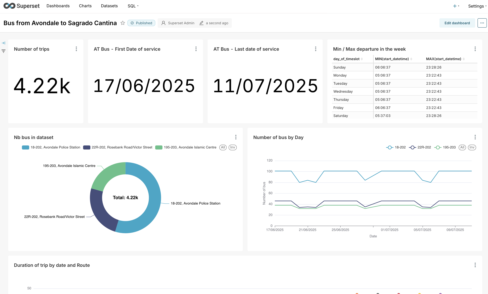
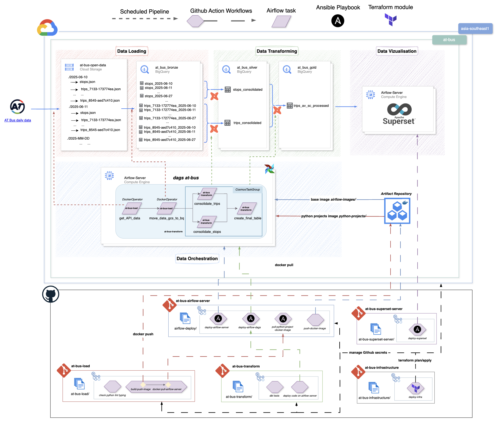

# AT Bus Superset Server

 


This repository is a part of AT Bus project. This project aims to build an ELT pipeline from open source data to a dashboard in order to visualise what are the best route bus from Avondale to Sagrado Cantina, a Mexican Restaurant in K Road, Auckland, New Zealand. The open data is provided by Auckland Transport [here](https://dev-portal.at.govt.nz/api-details#api=gtfs-api&operation=get-calendars-id).

All of the repositories of this project are the follow ones:

- at-bus-load: Python repository for loading data from the open API provided by Auckland Transport to a Google Cloud Storage bucket and then moved to BigQuery.
- at-bus-transform: dbt project for transforming the data from BigQuery bronze dataset to a BigQuery gold dataset.
- at-bus-superset-server: Superset server for visualising the BigQuery gold dataset (Ansible).
- at-bus-airflow-server: Airflow server for orchestrating the ELT pipeline (Ansible).
- at-bus-infrastructure: Infrastructure repository for managing the infrastructure of the project (Terraform).
 



---

A comprehensive Ansible-based deployment solution for Apache Superset, a modern data exploration and visualization platform.

## 📚 Table of Contents
1. [Overview](#overview)
2. [Features](#features)
3. [Project Structure](#project-structure)
4. [Prerequisites](#prerequisites)
5. [Quick Start](#quick-start)
6. [SSH Key Setup](#ssh-key-setup)
7. [Security with Ansible Vault](#security-with-ansible-vault)
8. [Configuration](#configuration)
9. [CI/CD Automation with GitHub Actions](#cicd-automation-with-github-actions)
10. [Deployment Steps](#deployment-steps)
11. [Post-Deployment](#post-deployment)
12. [Maintenance](#maintenance)
13. [Troubleshooting](#troubleshooting)
14. [Security Best Practices](#security-best-practices)
15. [Additional Resources](#additional-resources)

---

## 🚀 Overview
This project provides a complete, production-ready deployment of Apache Superset using Ansible and Docker Compose. It includes automated installation, configuration, backup/restore capabilities, update management, and secure credential handling with Ansible Vault.

- Uses official Superset Docker images (no heavy repo clone)
- Designed for single-host deployments (not HA)
- Includes PostgreSQL and Redis containers
- Security best practices and monitoring

---

## ✨ Features
- **Automated Deployment**: Complete Ansible playbook for Superset installation
- **Docker Compose**: Containerized deployment with PostgreSQL and Redis
- **No Git Clone Required**: Uses official Docker images
- **Backup & Restore**: Automated backup and restore functionality
- **Version Management**: Easy upgrade/downgrade between Superset versions
- **Production Ready**: Security configs, monitoring, health checks
- **Comprehensive Documentation**: Detailed guides and troubleshooting
- **Ansible Vault**: Secure credential management

---

## 📁 Project Structure
```
at-bus-superset-server/
├── inventory/
│   └── hosts.yml                  # Target server configuration
├── group_vars/
│   ├── all.yml                    # Main configuration variables
│   └── vault.yml                  # Encrypted secrets (Ansible Vault)
├── templates/
│   ├── docker-compose.yml.j2      # Docker Compose template
│   ├── superset_config.py.j2      # Superset configuration
│   ├── env.j2                     # Environment variables
│   └── backup-manifest.j2         # Backup documentation
├── files/
│   └── init-superset.sh           # Initialization script
├── scripts/
│   └── setup-ssh.sh               # SSH key setup script
├── playbooks/
│   ├── deploy.yml                 # Main deployment playbook
│   ├── backup.yml                 # Backup playbook
│   ├── restore.yml                # Restore playbook
│   ├── update.yml                 # Update playbook
│   └── setup-ssh.yml              # SSH key setup playbook
├── ansible.cfg                    # Ansible configuration
├── requirements.yml               # Ansible collections
├── Makefile                       # Build and deployment automation
├── pyproject.toml                 # Python project configuration
├── .vault_pass                    # Vault password file (not in git)
├── superset_backup.sql            # Database backup (if any)
└── README.md                      # This file
```

---

## 📋 Prerequisites

### Control Node
- Ansible 6.0+
- Python 3.6+
- SSH access to target servers
- Git (for cloning this repository)
- uv (Python package manager) - [Install uv](https://docs.astral.sh/uv/getting-started/installation/)
- Required Ansible collections (see below)

### Target Server
- Ubuntu 20.04+ or CentOS 8+ (x86_64)
- Minimum 4GB RAM (8GB recommended)
- 20GB+ disk space
- Python 3.6+
- Internet connectivity

### Network
- SSH access from control node to target
- Port 8088 (Superset), 5432 (Postgres), 6379 (Redis)

---

## ⚡ Quick Start

### 1. Clone and Configure
```bash
git clone <your-repo-url>
cd at-bus-superset-server
uv sync
```

### 2. Install Required Collections
```bash
make install-collections
# Or manually:
ansible-galaxy collection install -r requirements.yml
```

### 3. Set Up Security (Ansible Vault)
```bash
echo "your-secure-vault-password" > .vault_pass
chmod 600 .vault_pass
uv run ansible-vault edit inventory/group_vars/all/vault.yml --vault-password-file .vault_pass
```

### 4. Update Inventory
```bash
nano inventory/hosts.yml
# Note: For CI/CD deployments using GitHub Actions, this file is generated automatically.
```

### 5. Deploy Superset
```bash
# Install required collections first
make install-collections

# Deploy using Makefile (recommended)
make deploy-superset

# Or using ansible-playbook directly
ansible-playbook -i inventory/hosts.yml playbooks/deploy.yml --vault-password-file .vault_pass
```

### 6. Access Superset
- URL: `http://your-server:8088`
- Username: `admin`
- Password: `admin` (change immediately!)

---

## 🔑 SSH Key Setup

This deployment requires SSH key-based authentication. You can set up SSH keys using the provided script, Ansible playbook, or manually.

### 🚀 Quick SSH Setup

#### Method 1: Automated Script (Recommended)
```bash
./scripts/setup-ssh.sh
```

#### Method 2: Manual Setup
```bash
ssh-keygen -t rsa -b 4096 -C "your-email@example.com" -f ~/.ssh/at-bus-superset-key
chmod 600 ~/.ssh/at-bus-superset-key
chmod 644 ~/.ssh/at-bus-superset-key.pub
ssh-copy-id -i ~/.ssh/at-bus-superset-key.pub at-bus-superset@34.151.111.45
ssh -i ~/.ssh/at-bus-superset-key at-bus-superset@34.151.111.45
```

#### Method 3: Using Ansible Playbook
```bash
uv run ansible-playbook playbooks/setup-ssh.yml
```

#### Troubleshooting SSH
- If you see `REMOTE HOST IDENTIFICATION HAS CHANGED`, run:
  ```bash
  ssh-keygen -R 34.151.111.45
  ```
- If `Permission denied (publickey)`, ensure your public key is in `~/.ssh/authorized_keys` on the VM.
- For more, see the SSH section at the end of this README.

---

## 🔒 Security with Ansible Vault

This deployment uses Ansible Vault to securely store sensitive information like passwords and API keys.

### What is Ansible Vault?
Ansible Vault allows you to encrypt sensitive data such as passwords, API keys, and other secrets. The encrypted data can be safely stored in version control without exposing sensitive information.

### Vault File Content Example
```yaml
# Database credentials
vault_postgres_user: "superset"
vault_postgres_password: "your-secure-db-password"
vault_postgres_db: "superset"
# Superset admin credentials
vault_superset_admin_user: "admin"
vault_superset_admin_password: "your-secure-admin-password"
vault_superset_admin_email: "admin@yourcompany.com"
vault_superset_admin_firstname: "Admin"
vault_superset_admin_lastname: "User"
# Secret key for Superset
vault_superset_secret_key: "your-very-long-secret-key"
# SSH credentials (if using password auth)
vault_ansible_password: "your-ssh-password"
# Additional credentials as needed
vault_redis_password: "your-redis-password"
vault_smtp_user: "smtp_user"
vault_smtp_password: "smtp_password"
```

### Running Playbooks with Vault
```bash
uv run ansible-playbook -i inventory/hosts.yml playbooks/deploy.yml --vault-password-file .vault_pass
# Or with interactive prompt
uv run ansible-playbook -i inventory/hosts.yml playbooks/deploy.yml --ask-vault-pass
```

---

## ⚙️ Configuration

Edit `group_vars/all.yml` to customize your deployment:
```yaml
# Superset Version
superset_version: "5.0.0"
# Admin User
superset_admin_user: "admin"
superset_admin_password: "admin"  # Change this!
# Database
postgres_user: "superset"
postgres_password: "superset"     # Change this!
# Ports
superset_port: "8088"
postgres_port: "5432"
redis_port: "6379"
# Features
superset_load_examples: true      # Set to false for production
```
- **SSL/TLS**: Configure in `group_vars/all.yml`
- **Authentication**: Modify `templates/superset_config.py.j2`
- **Resource Limits**: Adjust memory and CPU limits
- **Backup Retention**: Configure backup retention policy

---

## 🤖 CI/CD Automation with GitHub Actions

This project includes a GitHub Actions workflow (`.github/workflows/deploy-superset.yml`) for automated deployment to a Google Cloud Platform (GCP) VM.

### Workflow Overview
- **Trigger**: Runs on push/pull_request to `main` or can be triggered manually (`workflow_dispatch`).
- **VM Management**: Automatically checks if the target VM is running and starts it if it's stopped.
- **Dynamic Inventory**: Generates the Ansible inventory on-the-fly using the VM's IP address.
- **Secure SSH**: Creates a temporary SSH key for the deployment and adds it to the VM's metadata, then cleans it up afterward.
- **Deployment**: Runs the `make deploy-superset` command to deploy Superset.

### Repository Setup
For the workflow to succeed, you must configure the following in your GitHub repository's **Settings > Secrets and variables > Actions**:

#### Secrets
- `GCP_PROJECT_ID`: Your Google Cloud Project ID.
- `GCP_SA_KEY`: The Base64-encoded JSON key for your GCP service account.
- `GCP_VM_INSTANCE_NAME`: The name of the target GCP VM instance.
- `VAULT_PASSWORD`: The password for Ansible Vault.

#### Variables
- `GCP_REGION_ZONE`: The GCP zone where the VM is located (e.g., `us-central1-a`).
- `GCP_SSH_USER`: The SSH username for the VM (e.g., `github-actions`).

---

## 🚀 Deployment Steps

### Standard Deployment
```bash
make deploy-superset
```

### Backup
```bash
make backup-superset
```

### Restore
```bash
make restore-superset BACK_UP_NAME=superset-backup-YYYY-MM-DDTHH-MM-SS
```

### Update
```bash
make update-superset NEW_SUPERSET_VERSION=5.0.0
```

### Available Make Commands
```bash
# Install Ansible collections
make install-collections

# Check playbook syntax
make check-syntax-playbooks

# Deploy Superset
make deploy-superset

# Backup Superset
make backup-superset

# Restore from backup
make restore-superset BACK_UP_NAME=backup-name

# Update Superset version
make update-superset NEW_SUPERSET_VERSION=5.0.0
```

### Manual Ansible Commands
```bash
uv run ansible-playbook -i inventory/hosts.yml playbooks/deploy.yml --vault-password-file .vault_pass
uv run ansible-playbook -i inventory/hosts.yml playbooks/backup.yml --vault-password-file .vault_pass
uv run ansible-playbook -i inventory/hosts.yml playbooks/restore.yml --vault-password-file .vault_pass -e "backup_to_restore=backup-name"
uv run ansible-playbook -i inventory/hosts.yml playbooks/update.yml --vault-password-file .vault_pass -e "new_superset_version=5.0.0"
```

---

## 📝 Post-Deployment
- Access Superset at `http://your-server:8088`
- Change all default passwords immediately
- Review logs in `/opt/superset/logs/`
- Set up monitoring and regular backups

---

## 🛠️ Maintenance
- **Health Checks**: `http://your-server:8088/health`
- **PostgreSQL Logs**: `docker logs superset-postgres`
- **Redis Logs**: `docker logs superset-redis`
- **Application Logs**: `/opt/superset/logs/`
- **Ansible Logs**: `/tmp/ansible.log`

---

## 🐛 Troubleshooting

### SSH Issues
- **Permission Denied**: Check key permissions and ensure the public key is in `~/.ssh/authorized_keys` on the VM.
- **Connection Refused**: Ensure the VM is running and SSH is enabled.
- **Host Key Verification Failed**: Run `ssh-keygen -R <host>` to remove old host keys.
- **Debug SSH**: Use `ssh -v -i ~/.ssh/at-bus-superset-key at-bus-superset@34.151.111.45` for verbose output.

### Ansible Issues
- **Missing Variables**: Ensure all required variables are set in `group_vars/all.yml` and `vault.yml`.
- **Vault Errors**: Make sure `.vault_pass` is correct and has proper permissions.
- **Docker Issues**: Ensure Docker is installed and running on the target server.

### General Debugging
- Check logs in `/opt/superset/logs/` and with `docker logs <container>`
- Use `ansible-playbook -vvv ...` for verbose Ansible output

---

## 🔒 Security Best Practices
- Change all default credentials
- Use strong, unique passwords
- Enable SSL/TLS for web access
- Restrict firewall rules to necessary ports
- Regularly update all software and dependencies
- Monitor logs and set up alerts
- Use Ansible Vault for all secrets
- Disable password SSH login after key setup

---

## 📚 Additional Resources
- [Apache Superset Documentation](https://superset.apache.org/docs/installation/installing-superset-using-docker-compose)
- [Ansible Documentation](https://docs.ansible.com/)
- [Ansible Vault](https://docs.ansible.com/ansible/latest/user_guide/vault.html)
- [OpenSSH Documentation](https://www.openssh.com/manual.html)
- [SSH Key Management](https://www.ssh.com/academy/ssh/key)

---

## 🆘 Support
If you encounter issues:
1. Check the troubleshooting section above
2. Verify VM is running and accessible
3. Check firewall settings
4. Verify SSH service is running on VM
5. Check SSH logs on VM: `sudo journalctl -u sshd`
